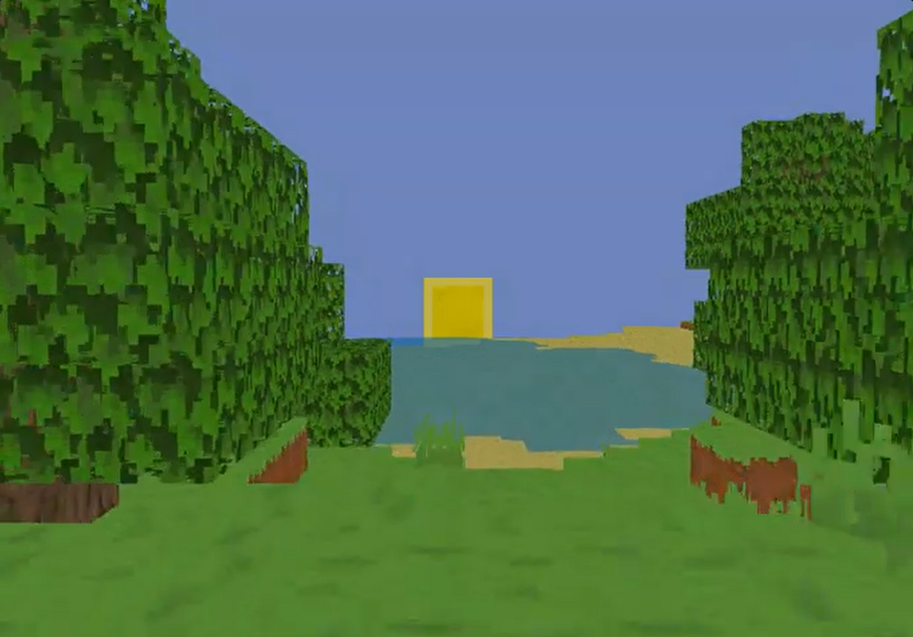

# OpenGL Voxel Game
This is my simple voxel game built using C++, OpenGL. 

## Most Recent Upload
The latest video upload of this project can be viewed by clicking the image here:

Clips taken to demonstrate features and the overall progress of this project are all 
uploaded to [this channel](https://www.youtube.com/@MisterPuggsProgramming).

## Overview
This is my simple voxel game built using C++, OpenGL. It utilises 16x16x256 block chunks
and procedural generation to create a world that the player can interact with. This 
project has provided me with the opportunity to heavily develop my skills in C++ and art,
as all block designs and art elements are created by myself. Original Aseprite files for
block tilesheets can be found [here](resources/asepriteFiles).

## Features
The features that I have currently implemented

- Procedural world generation for a large-scale area
- Naturally generated foliage through trees and grass
- Destructable and placeable blocks
- Threaded block meshing chunk generation
- Running, jumping and swimming within water

## ToDo
In order of importance, the following features are due to be implemented next

- Unload chunks which are outside of the player's area (prevent constant increase in memory usage)
- Proper lighting system
- Ambient Occlusion of block verticies
- Seeded procedural generation (currently, the same world will always generate)
- Variation in structure and foliage generation
- Storing chunk data for reloading (for retaining player interactions within the chunk)

## Libraries
The following are the libraries and versions used by myself when creating and building
this project.

- [glew 2.1.0](https://github.com/nigels-com/glew/releases)
- [SDL2 2.28.5](https://github.com/libsdl-org/SDL/releases)
- [SDL2 Image 2.8.2](https://github.com/libsdl-org/SDL_image/releases)
- [SDL2 TTF 2.20.2](https://github.com/libsdl-org/SDL_ttf/releases)
- [glm 1.0.2](https://github.com/g-truc/glm)

